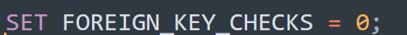
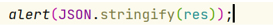
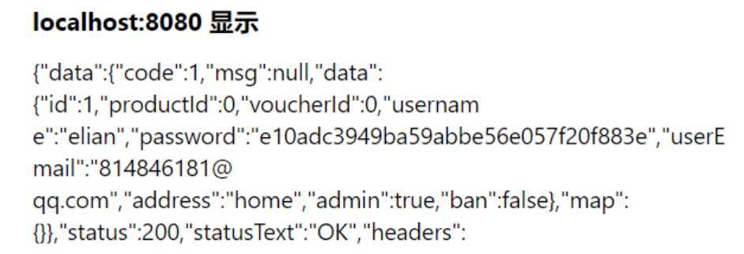
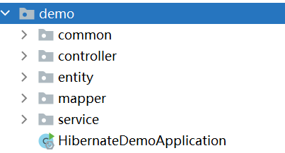

# hibernate-demo

# 

版本汇总：

后端JAVA 17，Spring Boot 2.7.3，MySQL 5.7.24，Hibernate > 3   支持Spring JPA

前端Vue3 + ElementPlus 基础应用 

npm install serve之前

要安装ElementPlus 插件：  **npm install element-plus --save**

和axios：     **npm install axios -S** 

数据库sql已经给出，由于我能力有限，关闭了外键约束（开外键约束不好进行模块开发），但是外键的关系已经按照咱们proposal里面建立好

开启外键约束把sql最后一句0改成1即可

后端API 

服务器地址:http://localhost:3000

| url       | 请求方式 | 参数                  | 响应                                                         |
| --------- | -------- | --------------------- | ------------------------------------------------------------ |
| /login    | post     | password,username     | { code: 1, message: 'null', data{...} }                      |
| /login    | post     | password,username     | { code: 0, message: 'login failed', data{...} }              |
| /register | post     | password,username.... | 成功{"code":1,"msg":null,"data":"register success","map":{}} |
| /register | post     | password,username.... | 失败{"code":0,"msg":"username already existed","data":null,"map":{}} |

返回值：自定义R.class, 用json数据传递，code表示请求成功/失败 （0/1） msg表示返回信息  data表示传递的数据（比如查询的类）

例如 /login  post请求成功 返回查到的数据库中的user

关于我的登录注册模块：密码用了md5加密 存储在数据库

我本来想实现一个拦截器拦住直接url访问主页，但是前后端分离写后端拦截器好像没用，前端我真不太会，有一点小bug

关于后端的框架：entity下面是实体类，主要的控制逻辑在controller，映射关系在mapper中，hibernate实现spring jpa完成

common中是通用组件，R.java表示返回结果，还有一些数据转换和异常处理

